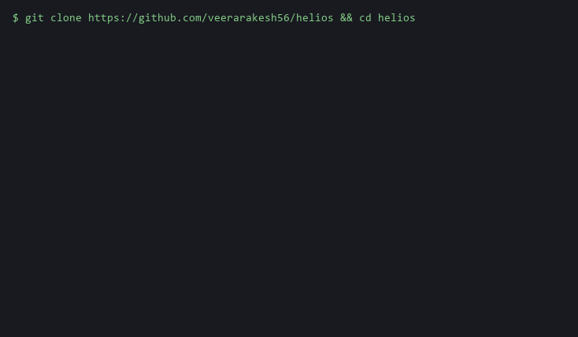

# Helios

> Deterministic failure simulation for cloud infrastructure.
> Proves exactly which services break under declared failure scenarios -- *before* `terraform apply`.



**Status:** v0.1.0. Eight AWS resource kinds, five scenario kinds, GitHub Action, web viewer.

## What it does

Point Helios at your Terraform code. Describe a failure as YAML (e.g. *"us-east-1 loses one AZ for 45 minutes"*). Helios parses everything into a typed resource graph, uses Z3 to symbolically execute the failure through the graph, and returns the exact failure chains with auto-generated Terraform fixes that it has **proved** resolve the failure (by re-simulating).

## Quickstart

```bash
git clone https://github.com/veerarakesh56/helios && cd helios
make demo
```

`make demo` simulates an AZ outage against the bundled three-tier webapp fixture, narrates the failure chain via the AI shell, applies a structured fix proposal, and re-verifies. Set `HELIOS_AI_MOCK=1` for a no-network run.

For a real run, set `ANTHROPIC_API_KEY` and point `HELIOS_AI_PYTHON` at the interpreter that has `helios_ai` installed (e.g. `helios-ai/.venv/bin/python`).

## Architecture at a glance

- **Rust + Z3** engine -- correctness is non-negotiable, so verdicts come from an SMT solver.
- **Python + Claude** shell -- narration, fix proposals, natural-language scenario parsing. The shell never decides what is safe; it only makes rigorous results human-readable.

See [`docs/ARCHITECTURE.md`](./docs/ARCHITECTURE.md) for the deep dive and [`docs/ai-boundary.md`](./docs/ai-boundary.md) for why the AI shell never produces a safety verdict.

## Roadmap (v0.1)

| Weekend | Milestone |
|---|---|
| 1 | Cargo workspace, graph builder, 8 AWS resource types |
| 2 | Z3 engine, region + AZ outage scenarios |
| 3 | Claude-powered explanation layer with prompt caching |
| 4 | Claude-proposed Terraform fixes, engine-verified |
| 5 | GitHub Action + cytoscape.js web UI |
| 6 | Demo GIF, docs, v0.1.0 release |

## Weekend 2 -- Engine v0

- Z3-backed SMT encoding for `region-outage` + `az-outage` scenarios.
- First E2E: `helios simulate fixtures/three-tier-webapp --scenario fixtures/scenarios/az-outage.yaml` prints the failure chain.
- Scenario schema documented in [`docs/scenarios.md`](docs/scenarios.md).

## Weekend 3 -- Claude explain layer

- `helios simulate ... --json` emits the `FailureChain` as JSON on stdout.
- `helios-ai/` is a uv-managed Python package that reads that JSON on stdin and writes a human-readable markdown narrative on stdout via Claude, with prompt caching on the system prompt + availability-model glossary.
- `helios explain` shells out to `python -m helios_ai explain` so you can pipe end-to-end:

  ```bash
  helios simulate ./infra --scenario scenarios/az-outage.yaml --json | helios explain
  ```

  Set `ANTHROPIC_API_KEY` in the environment, and set `HELIOS_AI_PYTHON` to point at the Python interpreter that has `helios_ai` installed if it is not on `PATH`.

- See [`helios-ai/`](helios-ai/) for the Python side and [`docs/ai-boundary.md`](docs/ai-boundary.md) for why Claude only narrates and never decides.

## Weekend 4 -- Fix generation + verify loop

- `helios-ai propose-fix` reads `{chain, attrs_snapshot}` JSON on stdin and emits a structured `FixProposal` (`{scenario_name, explanation, edits[]}`) via Claude with `output_config.format` and a two-breakpoint cache.
- `helios verify <tf-json> --scenario <yaml> --fix <json>` re-simulates with the fix applied and reports `Resolved` / `Still failing` / `New failures introduced` sections, exiting non-zero if anything still fails.

## Weekend 5 -- GitHub Action + web viewer

- `helios inspect <tf-json> --scenario <yaml>` emits `{scenario, graph: {nodes, edges}, chain}` as a single JSON document on stdout -- the input the GitHub Action uploads as an artifact and the web viewer renders.
- **GitHub Action** at [`action/`](./action) is a composite action that runs over every scenario in `fixtures/scenarios/*.yaml`, optionally re-runs `helios verify` if a matching `fixes/<scenario>.json` is committed, uploads each `inspect` JSON as a workflow artifact, and posts a single sticky PR comment summarising the verdict (one collapsible `<details>` per scenario). Caches the prebuilt `helios` binary keyed on `Cargo.lock` + crate sources, so the second run on a PR is fast.

  Wire it into a workflow:

  ```yaml
  on: pull_request
  permissions:
    contents: read
    pull-requests: write
  jobs:
    helios:
      runs-on: ubuntu-latest
      steps:
        - uses: actions/checkout@v4
        - uses: veerarakesh56/helios/action@v0.1.0
          with:
            github-token: ${{ secrets.GITHUB_TOKEN }}
  ```

- **Web viewer** at [`web/`](./web) is a Vite + React + cytoscape.js single-page app. `npm run dev` for local dev; `npm run build` for a static bundle. Drag a `helios inspect` JSON into the file picker (or paste it into the textarea) -- failed resources render red, `Contains` edges thick + solid, `MemberOf` edges thin + dashed, click any node to see its Terraform attrs and failure reason.

## Contributing

See [`CONTRIBUTING.md`](./CONTRIBUTING.md). The easiest first PRs add new AWS resource types or new scenario kinds.

## License

Apache-2.0. See [`LICENSE`](./LICENSE).
