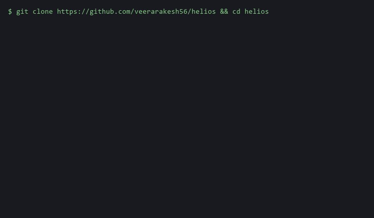

# Helios

[](https://github.com/veerarakesh56/helios/actions/workflows/ci.yml)
[](https://www.rust-lang.org)
[](LICENSE)

> Deterministic failure simulation for cloud infrastructure.
> Proves exactly which services break under a declared failure — *before* `terraform apply`.



**Status:** v0.1.4 released; `main` carries the unreleased 0.2.0 work (see the changelog): 18 AWS
resource kinds, 6 failure scenarios, `terraform show -json` of a state *or a saved plan*, a GitHub
Action that runs every scenario on a pull request and posts the verdict, and a web viewer.
**200 tests (148 Rust, 52 Python), plus 7 for the viewer and 7 for the publish guards.**

> The Action **reports** by default. Set `fail-on: failures` to make it block: after the comment and
> artifacts are posted, it fails the job when any scenario has failures and no committed fix, its fix
> does not verify, or it is **inconclusive** (Helios could not evaluate it). The CLI blocks on its own:
> `simulate` and `verify` exit 1 on failures (or an error) and **3** when inconclusive.

| | |
|---|---|
| **Engine** | Rust + **Z3 SMT** — every verdict is solved for, never estimated |
| **AI shell** | Python + Claude — narrates counter-examples and proposes Terraform fixes |
| **The boundary** | the model never produces a verdict; **every AI-proposed fix is re-simulated by the engine before it counts** |
| **Input** | `terraform show -json` of a state, or of a saved plan (before apply) |
| **Scenarios** | AZ outage · region outage · IAM revocation · single-NAT death · slow RDS failover · resource loss |
| **Resources** | VPC · Subnet · Instance · Load balancer · RDS instance · Aurora cluster + instances · ElastiCache cluster + replication group · Lambda · S3 · ECS cluster + service · EKS cluster + node group · SQS · VPC endpoint · NAT gateway |
| **CI** | a composite GitHub Action posts one sticky PR comment with the verdict per scenario |

## The problem

You cannot test an availability-zone outage. You can reason about one, draw it on a whiteboard, and
be confident — and confidence is exactly the thing that fails at 3 a.m. The infrastructure that broke
was usually reviewed by someone competent who traced the dependency chain in their head and missed
one edge.

Asking an LLM instead does not fix it. Given a Terraform file and *"what breaks if we lose an AZ?"*, a
model will always produce a confident, plausible answer. Plausible is not the same as correct, and in
availability work the difference only shows up during an incident.

**Helios does not reason about the failure. It solves for it.** The graph and the scenario become an
SMT problem, Z3 executes the failure symbolically, and what comes back is a proof, not an opinion.

## What it does

```
terraform show -json  ─┐
                       ├─►  typed resource graph  ─►  Z3  ─►  failure chain
scenario.yaml         ─┘                                          │
                                                                  ▼
                                              Claude narrates it, proposes a fix
                                                                  │
                                                                  ▼
                                              engine RE-SIMULATES with the fix applied
                                              Resolved / Still failing / New failures introduced
```

The last step is the point. A fix the model suggests is not trusted because it sounds right — it is
applied to a clone of the graph, re-solved, and reported as `Resolved`, `Still failing` or
`New failures introduced`, exiting non-zero if anything still fails.

## Quickstart

```bash
git clone https://github.com/veerarakesh56/helios && cd helios
make demo
```

`make demo` simulates an AZ outage against the bundled three-tier webapp fixture, narrates the
failure chain through the AI shell, applies a structured fix proposal, and re-verifies. It runs
mocked (`HELIOS_AI_MOCK=1`, no network) unless you say otherwise.

For a real run, `uv sync` in `helios-ai/`, then either set `ANTHROPIC_API_KEY`, or set
`HELIOS_AI_PROVIDER=claude_cli` to use a logged-in `claude` CLI (a Claude Max plan, no API key; see
`helios-ai/README.md`), and run `make demo HELIOS_AI_MOCK=0`. `helios explain` uses `HELIOS_AI_PYTHON` if set, else
`helios-ai/.venv` when run from the repo root, else `python` on PATH.

**Windows:** the build downloads Z3 and links `libz3.dll`, which is not copied next to `helios.exe`.
`cargo run -p helios-cli -- …` puts it on PATH for you. To run the binary directly, copy the DLL
once (Git Bash):

```bash
cp "$(find target/debug/build -name libz3.dll | head -1)" target/debug/   # or target/release
```

## Commands

```bash
helios plan     <tf-json-dir>                             # source (state|plan), resource and edge counts
helios simulate <tf-json> --scenario <yaml> [--json]      # run the engine, print the failure chain
helios explain  < chain.json                              # Claude narrates it, via the Python shell
helios propose-fix <tf-json> --scenario <yaml>            # simulate, then Claude proposes a FixProposal
helios verify   <tf-json> --scenario <yaml> --fix <json>  # re-simulate with the fix, diff the result
helios inspect  <tf-json> --scenario <yaml>               # {scenario, graph, chain} for viewer/Action
```

Pipe them:

```bash
helios simulate ./infra --scenario scenarios/az-outage.yaml --json | helios explain
```

## Scenarios

Five kinds ship in `fixtures/scenarios/`, each a small YAML document (schema in
[`docs/scenarios.md`](docs/scenarios.md)):

| Scenario | Asks |
|---|---|
| `az-outage` | one availability zone disappears for a stated duration |
| `region-outage` | an entire region goes |
| `iam-revocation` | a role or policy is pulled |
| `single-nat-death` | the one NAT gateway everything egresses through dies |
| `slow-rds-failover` | the database fails over, but not quickly |

Adding a scenario kind or an AWS resource type is the easiest first contribution — see
[`CONTRIBUTING.md`](./CONTRIBUTING.md).

## Fix generation, and why it is verified

`helios-ai propose-fix` reads `{chain, attrs_snapshot}` on stdin and returns a structured
`FixProposal` (`{scenario_name, explanation, edits[]}`) from Claude using `output_config.format` and
a two-breakpoint prompt cache — so the *shape* of a fix is enforced by the type, not by the prompt.

`helios verify` then applies those edits to a clone of the graph and re-runs the solver. It prints
`Pre-fix failures` / `Post-fix failures` and the three sections that matter — `Resolved`,
`Still failing`, `New failures introduced` — exiting non-zero if anything still fails.

**A fix that introduces a new failure is caught by the engine, not by a reviewer.**

## GitHub Action

[`action/`](./action) is a composite action. It runs every scenario in `fixtures/scenarios/*.yaml`,
optionally re-runs `helios verify` when a matching `fixes/<scenario>.json` is committed, uploads each
`inspect` JSON as a workflow artifact, and posts **one sticky PR comment** summarising the verdict —
a collapsible `<details>` per scenario. It caches the prebuilt binary on `Cargo.lock` + crate
sources, so the second run on a PR is fast.

```yaml
on: pull_request
permissions:
  contents: read
  pull-requests: write
jobs:
  helios:
    runs-on: ubuntu-latest
    steps:
      - uses: actions/checkout@v4
      - uses: veerarakesh56/helios/action@v0.1.4
        with:
          github-token: ${{ secrets.GITHUB_TOKEN }}
          fail-on: failures   # optional; default `never` only reports
```

## Web viewer

[`web/`](./web) is a Vite + React + cytoscape.js single-page app. `npm run dev` for local dev,
`npm run build` for a static bundle. Drop a `helios inspect` JSON into the file picker: failed
resources render red, `Contains` edges thick and solid, `MemberOf` edges thin and dashed, `Spread`
edges (placement-group members) medium and dotted. Click any
node for its Terraform attributes and the reason it failed.

## Architecture

- **Rust + Z3 engine** — correctness is non-negotiable, so verdicts come from an SMT solver. Reads
  `terraform show -json` into a `petgraph::DiGraph`, encodes the scenario as constraints, and solves.
- **Python + Claude shell** — narration and fix proposals: `explain` and `propose-fix`, the only two
  subcommands it has. **The shell never decides what is safe.** It makes rigorous results readable.
  Scenario YAML is parsed in Rust (`crates/helios-engine/src/scenario.rs`) and an unknown kind is a
  parse error; natural-language scenario parsing is a v0.2 plan (see `docs/ai-boundary.md`), not
  shipped — the shell has no scenario module at all.

[`docs/ARCHITECTURE.md`](./docs/ARCHITECTURE.md) is the deep dive;
[`docs/ai-boundary.md`](./docs/ai-boundary.md) explains why the AI shell never produces a verdict.

## Tests

**200 tests (plus 7 for the web viewer and 7 for the publish guards in `scripts/`):**

| | |
|---|---|
| Rust | **148** across the graph and plan reader, engine, SMT encoding, verify loop and CLI — including exact failure sets for a synthetic Wave 4 stack, NAT egress, and every "not a pass" case |
| Python | **52** in `helios-ai/`, including syrupy snapshots of the model output |

CI runs `cargo test`, `cargo clippy`, `cargo fmt --check` and the Python suite on every push.

## Limits, stated plainly

- **AWS only**, and only the 18 resource kinds Helios models (plus 9 it reads only to link them). A
  resource Helios does not model is absent from the graph — it is not assumed healthy, it simply is
  not there. A modelled resource whose ZONE depends on one that is absent (an ECS service in a
  subnet from a data source) cannot be placed: a zone outage in its region is **inconclusive**.
- **It reads `terraform show -json`, not live AWS.** `crates/helios-aws` is a stub: live-state
  collection for drift detection is designed but **not implemented**, and its SDK dependencies are
  commented out. Nothing in Helios talks to an AWS account.
- **A plan is read through its references, not evaluated.** Before apply, an attribute computed
  from another resource is unknown, so Helios follows the configuration's `references`. References
  through `local.*`, `var.*`, module outputs and `dynamic` blocks are **not followed**: the edge is
  missing, with a warning naming the resource and attribute. Terraform records only *which*
  values an index uses, so `aws_subnet.x[count.index % 2]` looks like `[count.index]`: Helios
  pairs by index only when both blocks have as many instances (else it links every instance, with
  a warning); an equal-count permutation such as `[(count.index + 1) % 2]` is not detectable.
- **An `iam-revocation` on a plan may be inconclusive.** A role's ARN is assigned at apply, so a
  resource's role is matched through the `aws_iam_role` its configuration references (by ARN
  name, role name or Terraform address; the account in the ARN is not checked). When a role
  comes through a variable, local, module output or data source — even as one branch of a
  conditional — Helios cannot say whether it is the revoked role: the run is
  **inconclusive**: exit code **3**, no document on stdout, and the Action reports it and fails
  the gate. It is never reported as a pass. A principal NO resource uses is an error, not a pass.
- **A subnet no route-table association can name** uses the VPC's main route table: the one an
  `aws_main_route_table_association` names, else an adopted `aws_default_route_table`. A main
  table Terraform does not manage is invisible, so such a subnet has no NAT edge. When an
  association's `subnet_id` cannot be resolved (`subnet_id = each.value.id` over a `for_each` of
  subnets), the subnet gets the NAT set every table it could be in agrees on; if they disagree —
  or a route table or default route is named through a local or variable — the egress of a subnet
  with compute in it is **unknown**, and a zone outage in the region, or losing a NAT, is
  inconclusive. So is losing a NAT while any compute's subnets cannot be placed (a Lambda whose
  `vpc_config` is a `dynamic` block): it may route through that NAT.
- **Regions come from the resources, else their provider.** A plan has no ARNs: a resource with
  no zone or `region` of its own takes its provider's constant `region`. Local and Wavelength
  Zones belong to their parent region.
- **An outage must aim at the estate.** An `az-outage` or `region-outage` naming a region no
  modelled resource is in is an error ("scenario targets region X; the modelled estate is in Y"),
  as is a malformed zone or region name. An empty zone in the estate's own region is a real pass,
  with a warning when nothing declares that zone. When nothing declares a region at all, a region
  outage is inconclusive.
- **Placement is worst case when it is unknown.** An Aurora instance's zone is unknown until apply,
  and where ECS tasks, EKS nodes or a Redis primary land is never in Terraform: capacity 1 (or an
  unknown zone) is treated as lost when *any* of its subnets is lost; capacity >= 2 as surviving
  while any is up (it assumes the scheduler spreads it). When a plan reference could not say
  exactly which subnets a group uses, every candidate is linked and the group is evaluated as
  lost when *any* is. A subnet, database or cache with no `availability_zone` is not guessed: an
  `az-outage` in its region is **inconclusive** (exit 3). An instance with no zone of its own is
  placed by its subnet.
- **A NAT gateway failure is an egress failure.** Compute in a subnet whose default route goes
  through the NAT (instances, ECS services, EKS node groups, and an in-VPC Lambda once every one of
  its subnets has lost egress) fails; a database, cache or endpoint in the same subnet does not.
  Egress is not combined with zone loss for Lambdas (one subnet's zone down, the other's NAT down
  is not reported).
- **Availability models are approximations.** Multi-AZ RDS is modelled as surviving one AZ; a real
  failover takes time, and `slow-rds-failover` exists precisely because that assumption is the
  interesting one to break.
- **Six scenario kinds** is not the space of real outages. It covers ones that recur.
- **Losing a queue does not fail its consumers.** Helios models whether a resource is up, not
  whether data flows: a Lambda's event-source queue and a queue's dead-letter queue are
  `MemberOf` edges, which do not propagate. `resource-loss` of a queue reports the queue alone.
- **Only what Terraform manages is visible.** Kubernetes workloads on an EKS node group, and
  anything created outside Terraform (a database made by a script, a console change), are not in
  the graph: losing the node group is reported, the pods on it are not.
- **The AI shell needs a model** for real narration: an Anthropic API key, or the `claude` CLI
  logged in (`HELIOS_AI_PROVIDER=claude_cli`). The engine does not — simulation and
  verification run entirely offline, and `HELIOS_AI_MOCK=1` exercises the whole pipeline with no
  network at all.

## Related

**[WARDEN](https://github.com/veerarakesh56/warden)** — the same principle applied to live incident
response: the model proposes, a deterministic verifier decides, nothing executes against
infrastructure.

## Changelog

Release history is in [`CHANGELOG.md`](./CHANGELOG.md).

## License

Apache-2.0. See [`LICENSE`](./LICENSE).
